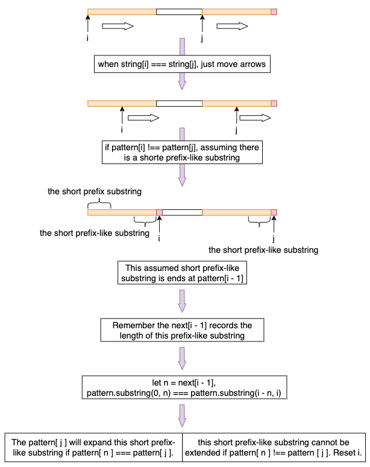

# Algorithm
## KMP
KMP is a string-searching algorithm. It first processes the pattern to produce a next array, which is then utilized to optimize the matching process.

Before delving into KMP, it's crucial to introduce a new concept: the 'prefix-like substring'. Consider the pattern "abcabtxyabcabc". At its end, there's a substring "abcab" that mirrors the order of the pattern's prefix, "abcab". KMP leverages this characteristic to enhance the efficiency of pattern matching.

The image below provides a visualization of the optimization process using the `next` array.


To facilitate and simplify the pattern matching process, we use an auxiliary array named `next`. This `next` array stores the length of the longest prefix-like substring that terminates at the given position.

Consider the string "abcabtxyabcabc". Its `next` array is represented as:


```text
index:   [0,  1,  2,  3,  4,  5,  6,  7,  8,  9,  10, 11, 12, 13]
pattern: [a,  b,  c,  a,  b,  t,  x,  y,  a,  b,  c,  a,  b,  c ]
next:    [0,  0,  0,  1,  2,  0,  0,  0,  1,  2,  3,  4,  5,  3 ]
```

In this example:
* `next[10] = 3` indicates that the substring "abc" aligns with the prefix "abc".
* `next[12] = 5` implies that the substring "abcab" matches the prefix "abcab".
* Interestingly, `next[13] = 3` reveals that the prefix-like substring is truncated at this juncture, matching the prefix "abc" instead.

The following image further elaborates on the optimization process:


